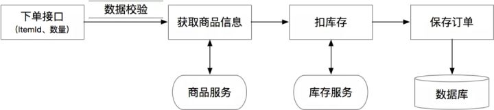
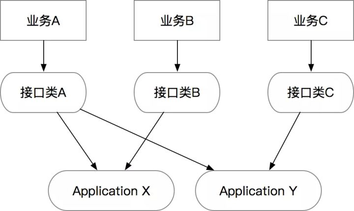
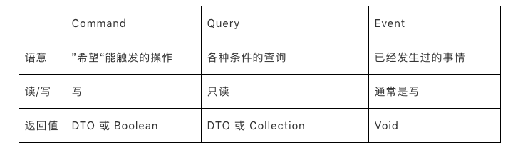
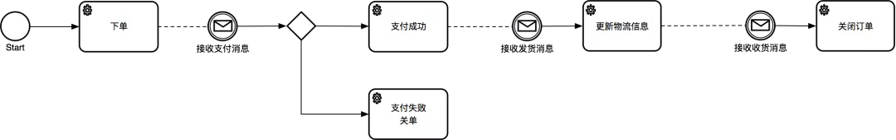
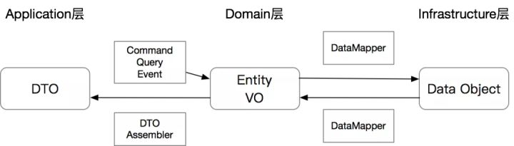
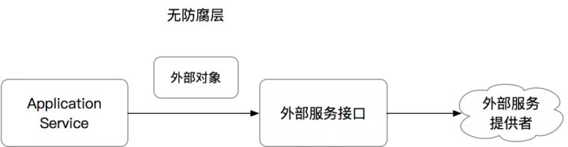
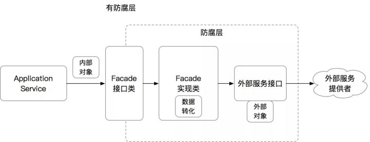
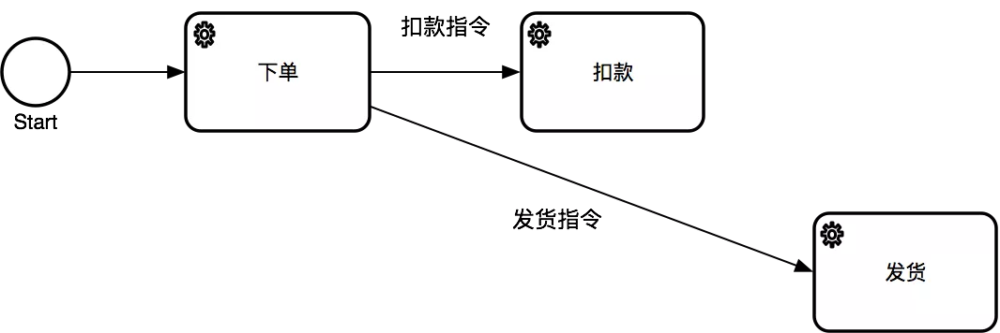
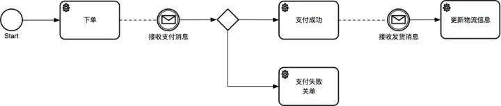
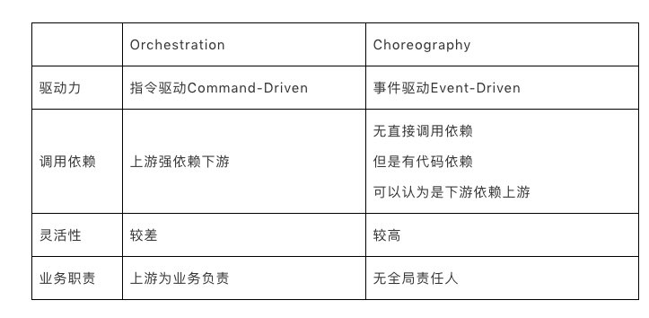

原文路径：

https://zhuanlan.zhihu.com/p/366395817

在过去一年里我们团队做了大量的老系统重构和迁移，其中有大量的代码属于流水账代码，通常能看到是开发在对外的API接口里直接写业务逻辑代码，或者在一个服务里大量的堆接口，导致业务逻辑实际无法收敛，接口复用性比较差。所以这讲主要想系统性的解释一下如何通过DDD的重构，将原有的流水账代码改造为逻辑清晰、职责分明的模块。

## 案例简介

这里举一个简单的常见案例：下单链路。假设我们在做一个checkout接口，需要做各种校验、查询商品信息、调用库存服务扣库存、然后生成订单：



一个比较典型的代码如下：

```java
@RestController
@RequestMapping("/")
public class CheckoutController {

    @Resource
    private ItemService itemService;

    @Resource
    private InventoryService inventoryService;

    @Resource
    private OrderRepository orderRepository;

    @PostMapping("checkout")
    public Result<OrderDO> checkout(Long itemId, Integer quantity) {
        // 1) Session管理
        Long userId = SessionUtils.getLoggedInUserId();
        if (userId <= 0) {
            return Result.fail("Not Logged In");
        }
      
        // 2）参数校验
        if (itemId <= 0 || quantity <= 0 || quantity >= 1000) {
            return Result.fail("Invalid Args");
        }

        // 3）外部数据补全
        ItemDO item = itemService.getItem(itemId);
        if (item == null) {
            return Result.fail("Item Not Found");
        }

        // 4）调用外部服务
        boolean withholdSuccess = inventoryService.withhold(itemId, quantity);
        if (!withholdSuccess) {
            return Result.fail("Inventory not enough");
        }
    
        // 5）领域计算
        Long cost = item.getPriceInCents() * quantity;

        // 6）领域对象操作
        OrderDO order = new OrderDO();
        order.setItemId(itemId);
        order.setBuyerId(userId);
        order.setSellerId(item.getSellerId());
        order.setCount(quantity);
        order.setTotalCost(cost);

        // 7）数据持久化
        orderRepository.createOrder(order);

        // 8）返回
        return Result.success(order);
    }
}
```

为什么这种典型的流水账代码在实际应用中会有问题呢？其本质问题是违背了SRP（Single Responsbility Principle）单一职责原则。这段代码里混杂了业务计算、校验逻辑、基础设施、和通信协议等，在未来无论哪一部分的逻辑变更都会直接影响到这段代码，长期当后人不断的在上面叠加新的逻辑时，会造成代码复杂度增加、逻辑分支越来越多，最终造成bug或者没人敢重构的历史包袱。

所以我们才需要用DDD的分层思想去重构一下以上的代码，通过不同的代码分层和规范，拆分出逻辑清晰，职责明确的分层和模块，也便于一些通用能力的沉淀。

主要的几个步骤分为：

1. 分离出独立的Interface接口层，负责处理网络协议相关的逻辑
2. 从真实业务场景中，找出具体用例（Use Cases），然后将具体用例通过专用的Command指令、Query查询、和Event事件对象来承接
3. 分离出独立的Application应用层，负责业务流程的编排，响应Command、Query和Event。每个应用层的方法应该代表整个业务流程中的一个节点
4. 处理一些跨层的横切关注点，如鉴权、异常处理、校验、缓存、日志等

下面会针对每个点做详细的解释。

## Interface接口层

随着REST和MVC架构的普及，经常能看到开发同学直接在Controller中写业务逻辑，如上面的典型案例，但实际上MVC Controller不是唯一的重灾区。以下的几种常见的代码写法通常都可能包含了同样的问题：

- HTTP 框架：如Spring MVC框架，Spring Cloud等
- RPC 框架：如Dubbo、HSF、gRPC等
- 消息队列MQ的“消费者”：比如JMS的 onMessage，RocketMQ的MessageListener等
- Socket通信：Socket通信的receive、WebSocket的onMessage等
- 文件系统：WatcherService等
- 分布式任务调度：SchedulerX等

这些的方法都有一个共同的点就是都有自己的网络协议，而如果我们的业务代码和网络协议混杂在一起，则会直接导致代码跟网络协议绑定，无法被复用。

所以，在DDD的分层架构中，我们单独会抽取出来Interface接口层，作为所有对外的门户，将网络协议和业务逻辑解耦。

**▐ 接口层的组成**

接口层主要由以下几个功能组成：

1. 网络协议的转化：通常这个已经由各种框架给封装掉了，我们需要构建的类要么是被注解的bean，要么是继承了某个接口的bean。
2. 统一鉴权：比如在一些需要AppKey+Secret的场景，需要针对某个租户做鉴权的，包括一些加密串的校验
3. Session管理：一般在面向用户的接口或者有登陆态的，通过Session或者RPC上下文可以拿到当前调用的用户，以便传递给下游服务。
4. 限流配置：对接口做限流避免大流量打到下游服务
5. 前置缓存：针对变更不是很频繁的只读场景，可以前置结果缓存到接口层
6. 异常处理：通常在接口层要避免将异常直接暴露给调用端，所以需要在接口层做统一的异常捕获，转化为调用端可以理解的数据格式
7. 日志：在接口层打调用日志，用来做统计和debug等。一般微服务框架可能都直接包含了这些功能。

当然，如果有一个独立的网关设施/应用，则可以抽离出鉴权、Session、限流、日志等逻辑，但是目前来看API网关也只能解决一部分的功能，即使在有API网关的场景下，应用里独立的接口层还是有必要的。

在interface层，鉴权、Session、限流、缓存、日志等都比较直接，只有一个异常处理的点需要重点说下。

## **▐ 返回值和异常处理规范，Result vs Exception**

注：这部分主要还是面向REST和RPC接口，其他的协议需要根据协议的规范产生返回值。

在我见过的一些代码里，接口的返回值比较多样化，有些直接返回DTO甚至DO，另一些返回Result。

接口层的核心价值是对外，所以如果只是返回DTO或DO会不可避免的面临异常和错误栈泄漏到使用方的情况，包括错误栈被序列化反序列化的消耗。所以，这里提出一个规范：

> 规范：Interface层的HTTP和RPC接口，返回值为Result，捕捉所有异常规范：Application层的所有接口返回值为DTO，不负责处理异常

Application层的具体规范等下再讲，在这里先展示Interface层的逻辑。

举个例子：

```java
@PostMapping("checkout")
public Result<OrderDTO> checkout(Long itemId, Integer quantity) {
    try {
        CheckoutCommand cmd = new CheckoutCommand();
        OrderDTO orderDTO = checkoutService.checkout(cmd);  
        return Result.success(orderDTO);
    } catch (ConstraintViolationException cve) {
        // 捕捉一些特殊异常，比如Validation异常
        return Result.fail(cve.getMessage());
    } catch (Exception e) {
        // 兜底异常捕获
        return Result.fail(e.getMessage());
    }
}
```

当然，每个接口都要写异常处理逻辑会比较烦，所以可以用AOP做个注解

```java
@Target(ElementType.METHOD)
@Retention(RetentionPolicy.RUNTIME)
public @interface ResultHandler {

}

@Aspect
@Component
public class ResultAspect {
    @Around("@annotation(ResultHandler)")
    public Object logExecutionTime(ProceedingJoinPoint joinPoint) throws Throwable {
        Object proceed = null;
        try {
            proceed = joinPoint.proceed();
        } catch (ConstraintViolationException cve) {
            return Result.fail(cve.getMessage());
        } catch (Exception e) {
            return Result.fail(e.getMessage());
        }
        return proceed;
    }
}
```

然后最终代码则简化为：

```java
@PostMapping("checkout")
@ResultHandler
public Result<OrderDTO> checkout(Long itemId, Integer quantity) {
    CheckoutCommand cmd = new CheckoutCommand();
    OrderDTO orderDTO = checkoutService.checkout(cmd);
    return Result.success(orderDTO);
}
```

## **▐ 接口层的接口的数量和业务间的隔离**

在传统REST和RPC的接口规范中，通常一个领域的接口，无论是REST的Resource资源的GET/POST/DELETE，还是RPC的方法，是追求相对固定的，统一的，而且会追求同一个领域的方法放在一个领域的服务或Controller中。

但是我发现在实际做业务的过程中，特别是当支撑的上游业务比较多时，刻意去追求接口的统一通常会导致方法中的参数膨胀，或者导致方法的膨胀。举个例子：假设有一个宠物卡和一个亲子卡的业务公用一个开卡服务，但是宠物需要传入宠物类型，亲子的需要传入宝宝年龄。

```java
// 可以是RPC Provider 或者 Controller
public interface CardService {

    // 1）统一接口，参数膨胀
    Result openCard(int petType, int babyAge);

    // 2）统一泛化接口，参数语意丢失
    Result openCardV2(Map<String, Object> params);

    // 3）不泛化，同一个类里的接口膨胀
    Result openPetCard(int petType);
    Result openBabyCard(int babyAge);
}
```

可以看出来，无论是怎么操作，都有可能导致CardService这个服务未来越来越难以维护，方法越来越多，一个业务的变更有可能会导致整个服务/Controller的变更，最终变得无法维护。我曾经参与过的一个服务，提供了几十个方法，上万行代码，可想而知无论是使用方对接口的理解成本还是对代码的维护成本都是极高的。所以，这里提出另一个规范：

> 规范：一个Interface层的类应该是“小而美”的，应该是面向“一个单一的业务”或“一类同样需求的业务”，需要尽量避免用同一个类承接不同类型业务的需求。

基于上面的这个规范，可以发现宠物卡和亲子卡虽然看起来像是类似的需求，但并非是“同样需求”的，可以预见到在未来的某个时刻，这两个业务的需求和需要提供的接口会越走越远，所以需要将这两个接口类拆分开：

```text
public interface PetCardService {
    Result openPetCard(int petType);
}

public interface BabyCardService {
    Result openBabyCard(int babyAge);
}
```

这个的好处是符合了Single Responsibility Principle单一职责原则，也就是说一个接口类仅仅会因为一个（或一类）业务的变化而变化。一个建议是当一个现有的接口类过度膨胀时，可以考虑对接口类做拆分，拆分原则和SRP一致。

也许会有人问，如果按照这种做法，会不会产生大量的接口类，导致代码逻辑重复？答案是不会，因为在DDD分层架构里，接口类的核心作用仅仅是协议层，每类业务的协议可以是不同的，而真实的业务逻辑会沉淀到应用层。也就是说Interface和Application的关系是多对多的：



因为业务需求是快速变化的，所以接口层也要跟着快速变化，通过独立的接口层可以避免业务间相互影响，但我们希望相对稳定的是Application层的逻辑。所以我们接下来看一下Application层的一些规范。

## Application层

## **▐ Application层的组成部分**

Application层的几个核心类：

- ApplicationService应用服务：最核心的类，负责业务流程的编排，但本身不负责任何业务逻辑
- DTO Assembler：负责将内部领域模型转化为可对外的DTO
- Command、Query、Event对象：作为ApplicationService的入参
- 返回的DTO：作为ApplicationService的出参

Application层最核心的对象是ApplicationService，它的核心功能是承接“业务流程“。但是在讲ApplicationService的规范之前，必须要先重点的讲几个特殊类型的对象，即Command、Query和Event。

## **▐ Command、Query、Event对象**

从本质上来看，这几种对象都是Value Object，但是从语义上来看有比较大的差异：

- Command指令：指调用方明确想让系统操作的指令，其预期是对一个系统有影响，也就是写操作。通常来讲指令需要有一个明确的返回值（如同步的操作结果，或异步的指令已经被接受）。
- Query查询：指调用方明确想查询的东西，包括查询参数、过滤、分页等条件，其预期是对一个系统的数据完全不影响的，也就是只读操作。
- Event事件：指一件已经发生过的既有事实，需要系统根据这个事实作出改变或者响应的，通常事件处理都会有一定的写操作。事件处理器不会有返回值。这里需要注意一下的是，Application层的Event概念和Domain层的DomainEvent是类似的概念，但不一定是同一回事，这里的Event更多是外部一种通知机制而已。

简单总结下：



- **为什么要用CQE对象？**

通常在很多代码里，能看到接口上有多个参数，比如上文中的案例：

```java
Result<OrderDO> checkout(Long itemId, Integer quantity);
```

如果需要在接口上增加参数，考虑到向前兼容，则需要增加一个方法：

```java
Result<OrderDO> checkout(Long itemId, Integer quantity);
Result<OrderDO> checkout(Long itemId, Integer quantity, Integer channel);
```

或者常见的查询方法，由于条件的不同导致多个方法：

```java
List<OrderDO> queryByItemId(Long itemId);
List<OrderDO> queryBySellerId(Long sellerId);
List<OrderDO> queryBySellerIdWithPage(Long sellerId, int currentPage, int pageSize);
```

可以看出来，传统的接口写法有几个问题：

1. 接口膨胀：一个查询条件一个方法
2. 难以扩展：每新增一个参数都有可能需要调用方升级
3. 难以测试：接口一多，职责随之变得繁杂，业务场景各异，测试用例难以维护

但是另外一个最重要的问题是：这种类型的参数罗列，本身没有任何业务上的”语意“，只是一堆参数而已，无法明确的表达出来意图。

- **CQE的规范**

所以在Application层的接口里，强力建议的一个规范是：

规范：ApplicationService的接口入参只能是一个Command、Query或Event对象，CQE对象需要能代表当前方法的语意。唯一可以的例外是根据单一ID查询的情况，可以省略掉一个Query对象的创建

按照上面的规范，实现案例是：

```java
public interface CheckoutService {
    OrderDTO checkout(@Valid CheckoutCommand cmd);
    List<OrderDTO> query(OrderQuery query);
    OrderDTO getOrder(Long orderId); // 注意单一ID查询可以不用Query
}

@Data
public class CheckoutCommand {
    private Long userId;
    private Long itemId;
    private Integer quantity;
}

@Data
public class OrderQuery {
    private Long sellerId;
    private Long itemId;
    private int currentPage;
    private int pageSize;
}
```

这个规范的好处是：提升了接口的稳定性、降低低级的重复，并且让接口入参更加语意化。

- **CQE vs DTO**

从上面的代码能看出来，ApplicationService的入参是CQE对象，但是出参却是一个DTO，从代码格式上来看都是简单的POJO对象，那么他们之间有什么区别呢？

- CQE：CQE对象是ApplicationService的输入，是有明确的”意图“的，所以这个对象必须保证其”正确性“。
- DTO：DTO对象只是数据容器，只是为了和外部交互，所以本身不包含任何逻辑，只是贫血对象。

但可能最重要的一点：因为CQE是”意图“，所以CQE对象在理论上可以有”无限“个，每个代表不同的意图；但是DTO作为模型数据容器，和模型一一对应，所以是有限的。

- **CQE的校验**

CQE作为ApplicationService的输入，必须保证其正确性，那么这个校验是放在哪里呢？

在最早的代码里，曾经有这样的校验逻辑，当时写在了服务里：

```java
if (itemId <= 0 || quantity <= 0 || quantity >= 1000) {
    return Result.fail("Invalid Args");
}
```

这种代码在日常非常常见，但其最大的问题就是大量的非业务代码混杂在业务代码中，很明显的违背了单一职责原则。但因为当时入参仅仅是简单的int，所以这个逻辑只能出现在服务里。现在当入参改为了CQE之后，我们可以利用java标准JSR303或JSR380的Bean Validation来前置这个校验逻辑。

> 规范：CQE对象的校验应该前置，避免在ApplicationService里做参数的校验。可以通过JSR303/380和Spring Validation来实现

前面的例子可以改造为：

```java
@Validated // Spring的注解
public class CheckoutServiceImpl implements CheckoutService {
    OrderDTO checkout(@Valid CheckoutCommand cmd) { // 这里@Valid是JSR-303/380的注解
        // 如果校验失败会抛异常，在interface层被捕捉
    }
}

@Data
public class CheckoutCommand {

    @NotNull(message = "用户未登陆")
    private Long userId;

    @NotNull
    @Positive(message = "需要是合法的itemId")
    private Long itemId;

    @NotNull
    @Min(value = 1, message = "最少1件")
    @Max(value = 1000, message = "最多不能超过1000件")
    private Integer quantity;
}
```

这种做法的好处是，让ApplicationService更加清爽，同时各种错误信息可以通过Bean Validation的API做各种个性化定制。

- **避免复用CQE**

因为CQE是有“意图”和“语意”的，我们需要尽量避免CQE对象的复用，哪怕所有的参数都一样，只要他们的语意不同，尽量还是要用不同的对象。

- **规范：针对于不同语意的指令，要避免CQE对象的复用**

❌ 反例：一个常见的场景是“Create创建”和“Update更新”，一般来说这两种类型的对象唯一的区别是一个ID，创建没有ID，而更新则有。所以经常能看见有的同学用同一个对象来作为两个方法的入参，唯一区别是ID是否赋值。这个是错误的用法，因为这两个操作的语意完全不一样，他们的校验条件可能也完全不一样，所以不应该复用同一个对象。正确的做法是产出两个对象：

```java
public interface CheckoutService {
    OrderDTO checkout(@Valid CheckoutCommand cmd);
    OrderDTO updateOrder(@Valid UpdateOrderCommand cmd);
}

@Data
public class UpdateOrderCommand {

    @NotNull(message = "用户未登陆")
    private Long userId;

    @NotNull(message = "必须要有OrderID")
    private Long orderId;

    @NotNull
    @Positive(message = "需要是合法的itemId")
    private Long itemId;

    @NotNull
    @Min(value = 1, message = "最少1件")
    @Max(value = 1000, message = "最多不能超过1000件")
    private Integer quantity;

}
```

## **▐** **ApplicationService**

ApplicationService负责了业务流程的编排，是将原有业务流水账代码剥离了校验逻辑、领域计算、持久化等逻辑之后剩余的流程，是“胶水层”代码。

参考一个简易的交易流程：



在这个案例里可以看出来，交易这个领域一共有5个用例：下单、支付成功、支付失败关单、物流信息更新、关闭订单。这5个用例可以用5个Command/Event对象代替，也就是对应了5个方法。

我见过3种ApplicationService的组织形态：

## **1**

一个ApplicationService类是一个完整的业务流程，其中每个方法负责处理一个Use Case。这种的好处是可以完整的收敛整个业务逻辑，从接口类即可对业务逻辑有一定的掌握，适合相对简单的业务流程。坏处就是对于复杂的业务流程会导致一个类的方法过多，有可能代码量过大。这种类型的具体案例如：

```java
public interface CheckoutService {

    // 下单
    OrderDTO checkout(@Valid CheckoutCommand cmd);

    // 支付成功
    OrderDTO payReceived(@Valid PaymentReceivedEvent event);

    // 支付取消
    OrderDTO payCanceled(@Valid PaymentCanceledEvent event);

    // 发货
    OrderDTO packageSent(@Valid PackageSentEvent event);

    // 收货
    OrderDTO delivered(@Valid DeliveredEvent event);

    // 批量查询
    List<OrderDTO> query(OrderQuery query);

    // 单个查询
    OrderDTO getOrder(Long orderId);
}
```

## **2**

针对于比较复杂的业务流程，可以通过增加独立的CommandHandler、EventHandler来降低一个类中的代码量：

```java
@Component
public class CheckoutCommandHandler implements CommandHandler<CheckoutCommand, OrderDTO> {
    @Override
    public OrderDTO handle(CheckoutCommand cmd) {
        //
    }
}

public class CheckoutServiceImpl implements CheckoutService {
    @Resource
    private CheckoutCommandHandler checkoutCommandHandler;
  
    @Override
    public OrderDTO checkout(@Valid CheckoutCommand cmd) {
        return checkoutCommandHandler.handle(cmd);
    }
}
```

## **3**

比较激进一点，通过CommandBus、EventBus，直接将指令或事件抛给对应的Handler，EventBus比较常见。具体案例代码如下，通过消息队列收到MQ消息后，生成Event，然后由EventBus做路由到对应的Handler：

```java
// Application层
// 在这里框架通常可以根据接口识别到这个负责处理PaymentReceivedEvent
// 也可以通过增加注解识别
@Component
public class PaymentReceivedHandler implements EventHandler<PaymentReceivedEvent> {
    @Override
    public void process(PaymentReceivedEvent event) {
        //
    }
}

// Interface层，这个是RocketMQ的Listener
public class OrderMessageListener implements MessageListenerOrderly {

    @Resource
    private EventBus eventBus;
  
    @Override
    public ConsumeOrderlyStatus consumeMessage(List<MessageExt> msgs, ConsumeOrderlyContext context) {
      
        PaymentReceivedEvent event = new PaymentReceivedEvent();
        eventBus.dispatch(event); // 不需要指定消费者
      
        return ConsumeOrderlyStatus.SUCCESS;
    }
}
```

**不建议**

这种做法可以实现Interface层和某个具体的ApplicationService或Handler的完全静态解藕，在运行时动态dispatch，做的比较好的框架如AxonFramework。虽然看起来很便利，但是根据我们自己业务的实践和踩坑发现，当代码中的CQE对象越来越多，handler越来越复杂时，运行时的dispatch缺乏了静态代码间的关联关系，导致代码很难读懂，特别是当你需要trace一个复杂调用链路时，因为dispatch是运行时的，很难摸清楚具体调用到的对象。所以我们虽然曾经有过这种尝试，但现在已经不建议这么做了。

- **Application Service 是业务流程的封装，不处理业务逻辑**

虽然之前曾经无数次重复ApplicationService只负责业务流程串联，不负责业务逻辑，但如何判断一段代码到底是业务流程还是逻辑呢？举个之前的例子，最初的代码重构后：

```java
@Service
@Validated
public class CheckoutServiceImpl implements CheckoutService {

    private final OrderDtoAssembler orderDtoAssembler = OrderDtoAssembler.INSTANCE;
    @Resource
    private ItemService itemService;
    @Resource
    private InventoryService inventoryService;
    @Resource
    private OrderRepository orderRepository;

    @Override
    public OrderDTO checkout(@Valid CheckoutCommand cmd) {
        ItemDO item = itemService.getItem(cmd.getItemId());
        if (item == null) {
            throw new IllegalArgumentException("Item not found");
        }

        boolean withholdSuccess = inventoryService.withhold(cmd.getItemId(), cmd.getQuantity());
        if (!withholdSuccess) {
            throw new IllegalArgumentException("Inventory not enough");
        }

        Order order = new Order();
        order.setBuyerId(cmd.getUserId());
        order.setSellerId(item.getSellerId());
        order.setItemId(item.getItemId());
        order.setItemTitle(item.getTitle());
        order.setItemUnitPrice(item.getPriceInCents());
        order.setCount(cmd.getQuantity());

        Order savedOrder = orderRepository.save(order);

        return orderDtoAssembler.orderToDTO(savedOrder);
    }
}
```

- **判断是否业务流程的几个点：**

**1**

不要有if/else分支逻辑：也就是说代码的Cyclomatic Complexity（循环复杂度）应该尽量等于1

通常有分支逻辑的，都代表一些业务判断，应该将逻辑封装到DomainService或者Entity里。但这不代表完全不能有if逻辑，比如，在这段代码里：

```java
boolean withholdSuccess = inventoryService.withhold(cmd.getItemId(), cmd.getQuantity());
if (!withholdSuccess) {
    throw new IllegalArgumentException("Inventory not enough");
}
```

虽然CC > 1，但是仅仅代表了中断条件，具体的业务逻辑处理并没有受影响。可以把它看作为Precondition。

**2**

不要有任何计算：

在最早的代码里有这个计算：

```java
// 5）领域计算
Long cost = item.getPriceInCents() * quantity;
order.setTotalCost(cost);
```

通过将这个计算逻辑封装到实体里，避免在ApplicationService里做计算

```java
@Data
public class Order {

    private Long itemUnitPrice;
    private Integer count;

    // 把原来一个在ApplicationService的计算迁移到Entity里
    public Long getTotalCost() {
        return itemUnitPrice * count;
    }
}

order.setItemUnitPrice(item.getPriceInCents());
order.setCount(cmd.getQuantity());
```

**3**

一些数据的转化可以交给其他对象来做：

比如DTO Assembler，将对象间转化的逻辑沉淀在单独的类中，降低ApplicationService的复杂度

```java
OrderDTO dto = orderDtoAssembler.orderToDTO(savedOrder);
```

- **常用的ApplicationService“套路”**

我们可以看出来，ApplicationService的代码通常有类似的结构：AppService通常不做任何决策（Precondition除外），仅仅是把所有决策交给DomainService或Entity，把跟外部交互的交给Infrastructure接口，如Repository或防腐层。

一般的“套路”如下：

- 准备数据：包括从外部服务或持久化源取出相对应的Entity、VO以及外部服务返回的DTO。
- 执行操作：包括新对象的创建、赋值，以及调用领域对象的方法对其进行操作。需要注意的是这个时候通常都是纯内存操作，非持久化。
- 持久化：将操作结果持久化，或操作外部系统产生相应的影响，包括发消息等异步操作。

如果涉及到对多个外部系统（包括自身的DB）都有变更的情况，这个时候通常处在“分布式事务”的场景里，无论是用分布式TX、TCC、还是Saga模式，取决于具体场景的设计，在此处暂时略过。

## **▐** **DTO Assembler**

一个经常被忽视的问题是 ApplicationService应该返回 Entity 还是 DTO？这里提出一个规范，在DDD分层架构中：

> ApplicationService应该永远返回DTO而不是Entity

为什么呢？

1. 构建领域边界：ApplicationService的入参是CQE对象，出参是DTO，这些基本上都属于简单的POJO，来确保Application层的内外互相不影响。
2. 降低规则依赖：Entity里面通常会包含业务规则，如果ApplicationService返回Entity，则会导致调用方直接依赖业务规则。如果内部规则变更可能直接影响到外部。
3. 通过DTO组合降低成本：Entity是有限的，DTO可以是多个Entity、VO的自由组合，一次性封装成复杂DTO，或者有选择的抽取部分参数封装成DTO可以降低对外的成本。

因为我们操作的对象是Entity，但是输出的对象是DTO，这里就需要一个专属类型的对象叫DTO Assembler。DTO Assembler的唯一职责是将一个或多个Entity/VO，转化为DTO。注意：DTO Assembler通常不建议有反操作，也就是不会从DTO到Entity，因为通常一个DTO转化为Entity时是无法保证Entity的准确性的。

通常，Entity转DTO是有成本的，无论是代码量还是运行时的操作。手写转换代码容易出错，为了节省代码量用Reflection会造成极大的性能损耗。所以这里我还是不遗余力的推荐MapStruct这个库。MapStruct通过静态编译时代码生成，通过写接口和配置注解就可以生成对应的代码，且因为生成的代码是直接赋值，其性能损耗基本可以忽略不计。

通过MapStruct，代码即可简化为：

```java
import org.mapstruct.Mapper;
@Mapper
public interface OrderDtoAssembler {
    OrderDtoAssembler INSTANCE = Mappers.getMapper(OrderDtoAssembler.class);
    OrderDTO orderToDTO(Order order);
}

public class CheckoutServiceImpl implements CheckoutService {
    private final OrderDtoAssembler orderDtoAssembler = OrderDtoAssembler.INSTANCE;

    @Override
    public OrderDTO checkout(@Valid CheckoutCommand cmd) {
        // ...
        Order order = new Order();  
        // ...
        Order savedOrder = orderRepository.save(order);
        return orderDtoAssembler.orderToDTO(savedOrder);
    }
}
```

结合之前的Data Mapper，DTO、Entity和DataObject之间的关系如下图：



## **▐** **Result vs Exception**

最后，上文曾经提及在Interface层应该返回Result，在Application层应该返回DTO，在这里再次重复提出规范：

> Application层只返回DTO，可以直接抛异常，不用统一处理。所有调用到的服务也都可以直接抛异常，除非需要特殊处理，否则不需要刻意捕捉异常

异常的好处是能明确的知道错误的来源，堆栈等，在Interface层统一捕捉异常是为了避免异常堆栈信息泄漏到API之外，但是在Application层，异常机制仍然是信息量最大，代码结构最清晰的方法，避免了Result的一些常见且繁杂的Result.isSuccess判断。所以在Application层、Domain层，以及Infrastructure层，遇到错误直接抛异常是最合理的方法。

## **▐** **Anti-Corruption Layer防腐层**

本文仅仅简单描述一下ACL的原理和作用，具体的实施规范可能要等到另外一篇文章。

在ApplicationService中，经常会依赖外部服务，从代码层面对外部系统产生了依赖。比如上文中的：

```java
ItemDO item = itemService.getItem(cmd.getItemId());
boolean withholdSuccess = inventoryService.withhold(cmd.getItemId(), cmd.getQuantity());
```

会发现我们的ApplicationService会强依赖ItemService、InventoryService以及ItemDO这个对象。如果任何一个服务的方法变更，或者ItemDO字段变更，都会有可能影响到ApplicationService的代码。也就是说，我们自己的代码会因为强依赖了外部系统的变化而变更，这个在复杂系统中应该是尽量避免的。那么如何做到对外部系统的隔离呢？需要加入ACL防腐层。

ACL防腐层的简单原理如下：

- 对于依赖的外部对象，我们抽取出所需要的字段，生成一个内部所需的VO或DTO类
- 构建一个新的Facade，在Facade中封装调用链路，将外部类转化为内部类
- 针对外部系统调用，同样的用Facade方法封装外部调用链路

无防腐层的情况：



有防腐层的情况：



具体简单实现，假设所有外部依赖都命名为ExternalXXXService：

```java
// 自定义的内部值类
@Data
public class ItemDTO {
    private Long itemId;
    private Long sellerId;
    private String title;
    private Long priceInCents;
}

// 商品Facade接口
public interface ItemFacade {
    ItemDTO getItem(Long itemId);
}
// 商品facade实现
@Service
public class ItemFacadeImpl implements ItemFacade {

    @Resource
    private ExternalItemService externalItemService;

    @Override
    public ItemDTO getItem(Long itemId) {
        ItemDO itemDO = externalItemService.getItem(itemId);
        if (itemDO != null) {
            ItemDTO dto = new ItemDTO();
            dto.setItemId(itemDO.getItemId());
            dto.setTitle(itemDO.getTitle());
            dto.setPriceInCents(itemDO.getPriceInCents());
            dto.setSellerId(itemDO.getSellerId());
            return dto;
        }
        return null;
    }
}

// 库存Facade
public interface InventoryFacade {
    boolean withhold(Long itemId, Integer quantity);
}
@Service
public class InventoryFacadeImpl implements InventoryFacade {

    @Resource
    private ExternalInventoryService externalInventoryService;

    @Override
    public boolean withhold(Long itemId, Integer quantity) {
        return externalInventoryService.withhold(itemId, quantity);
    }
}
```

通过ACL改造之后，我们ApplicationService的代码改为：

```java
@Service
public class CheckoutServiceImpl implements CheckoutService {

    @Resource
    private ItemFacade itemFacade;
    @Resource
    private InventoryFacade inventoryFacade;
  
    @Override
    public OrderDTO checkout(@Valid CheckoutCommand cmd) {
        ItemDTO item = itemFacade.getItem(cmd.getItemId());
        if (item == null) {
            throw new IllegalArgumentException("Item not found");
        }

        boolean withholdSuccess = inventoryFacade.withhold(cmd.getItemId(), cmd.getQuantity());
        if (!withholdSuccess) {
            throw new IllegalArgumentException("Inventory not enough");
        }

        // ...
    }
}
```

很显然，这么做的好处是ApplicationService的代码已经完全不再直接依赖外部的类和方法，而是依赖了我们自己内部定义的值类和接口。如果未来外部服务有任何的变更，需要修改的是Facade类和数据转化逻辑，而不需要修改ApplicationService的逻辑。

Repository可以认为是一种特殊的ACL，屏蔽了具体数据操作的细节，即使底层数据库结构变更，数据库类型变更，或者加入其他的持久化方式，Repository的接口保持稳定，ApplicationService就能保持不变。

在一些理论框架里ACL Facade也被叫做Gateway，含义是一样的。

## Orchestration vs Choreography

在本文最后想聊一下复杂业务流程的设计规范。在复杂的业务流程里，我们通常面临两种模式：Orchestration 和 Choreography。很无奈，这两个英文单词的百度翻译/谷歌翻译，都是“编排”，但实际上这两种模式是完全不一样的设计模式。

Orchestration的编排（比如SOA/微服务的服务编排Service Orchestration）是我们通常熟悉的用法，Choreography是最近出现了事件驱动架构EDA才慢慢流行起来。网上可能会有其他的翻译，比如编制、编舞、协作等，但感觉都没有真正的把英文单词的意思表达出来，所以为了避免误解，在下文我尽量还是用英文原词。如果谁有更好的翻译方法欢迎联系我。

## **▐** **模式简介**

Orchestration：通常出现在脑海里的是一个交响乐团（Orchestra，注意这两个词的相似性），如下图。交响乐团的核心是一个唯一的指挥家Conductor，在一个交响乐中，所有的音乐家必须听从Conductor的指挥做操作，不可以独自发挥。所以在Orchestration模式中，所有的流程都是由一个节点或服务触发的。我们常见的业务流程代码，包括调用外部服务，就是Orchestration，由我们的服务统一触发。

Choreography：通常会出现在脑海的场景是一个舞剧（来自于希腊文的舞蹈，Choros），如下图。其中每个不同的舞蹈家都在做自己的事，但是没有一个中心化的指挥。通过协作配合，每个人做好自己的事，整个舞蹈可以展现出一个完整的、和谐的画面。所以在Choreography模式中，每个服务都是独立的个体，可能会响应外部的一些事件，但整个系统是一个整体。

## **▐** **案例**

用一个常见的例子：下单后支付并发货如果这个案例是Orchestration，则业务逻辑为：下单时从一个预存的账户里扣取资金，并且生成物流单发货，从图上看是这样的：



如果这个案例是Choreography，则业务逻辑为：下单，然后等支付成功事件，然后再发货，类似这样：



## **模式的区别和选择**

虽然看起来这两种模式都能达到一样的业务目的，但是在实际开发中他们有巨大的差异：

- **从代码依赖关系来看：**

Orchestration：涉及到一个服务调用到另外的服务，对于调用方来说，是强依赖的服务提供方。

Choreography：每一个服务只是做好自己的事，然后通过事件触发其他的服务，服务之间没有直接调用上的依赖。但要注意的是下游还是会依赖上游的代码（比如事件类），所以可以认为是下游对上游有依赖。

- **从代码灵活性来看：**

Orchestration：因为服务间的依赖关系是写死的，增加新的业务流程必然需要修改代码。

Choreography：因为服务间没有直接调用关系，可以增加或替换服务，而不需要改上游代码。

- **从调用链路来看：**

Orchestration：是从一个服务主动调用另一个服务，所以是Command-Driven指令驱动的。

Choreography：是每个服务被动的被外部事件触发，所以是Event-Driven事件驱动的。

- **从业务职责来看：**

Orchestration：有主动的调用方（比如：下单服务）。无论下游的依赖是谁，主动的调用方都需要为整个业务流程和结果负责。Choreography：没有主动调用方，每个服务只关心自己的触发条件和结果，没有任何一个服务会为整个业务链路负责

- **小结：**



另外需要重点明确的：“指令驱动”和“事件驱动”的区别不是“同步”和“异步”。指令可以是同步调用，也可以是异步消息触发（但异步指令不是事件）；反过来事件可以是异步消息，但也完全可以是进程内的同步调用。所以指令驱动和事件驱动差异的本质不在于调用方式，而是一件事情是否“已经”发生。

- **所以在日常业务中当你碰到一个需求时，该如何选择是用Orchestration还是Choreography？**

这里给出两个判断方法：

1、明确依赖的方向：


在代码中的依赖是比较明确的：如果你是下游，上游对你无感知，则只能走事件驱动；如果上游必须要对你有感知，则可以走指令驱动。反过来，如果你是上游，需要对下游强依赖，则是指令驱动；如果下游是谁无所谓，则可以走事件驱动。

\2. 找出业务中的“负责人”：


第二种方法是根据业务场景找出其中的“负责人”。比如，如果业务需要通知卖家，下单系统的单一职责不应该为消息通知负责，但订单管理系统需要根据订单状态的推进主动触发消息，所以是这个功能的负责人。

在一个复杂业务流程里，通常两个模式都要有，但也很容易设计错误。如果出现依赖关系很奇怪，或者代码里调用链路/负责人梳理不清楚的情况，可以尝试转换一下模式，可能会好很多。

- **哪个模式更好？**

很显然，没有最好的模式，只有最合适自己业务场景的模式。

❌ 反例：最近几年比较流行的Event-Driven Architecture（EDA）事件驱动架构，以及Reactive-Programming响应式编程（比如RxJava），虽然有很多创新，但在一定程度上是“当你有把锤子，所有问题都是钉子”的典型案例。他们对一些基于事件的、流处理的问题有奇效，但如果拿这些框架硬套指令驱动的业务，就会感到代码极其“不协调”，认知成本提高。所以在日常选型中，还是要先根据业务场景梳理出来是哪些流程中的部分是Orchestration，哪些是Choreography，然后再选择相对应的框架。

## **▐** **跟DDD分层架构的关系**

最后，讲了这么多O vs C，跟DDD有啥关系？很简单：

- O&C其实是Interface层的关注点，Orchestration = 对外的API，而Choreography = 消息或事件。当你决策了O还是C之后，需要在interface层承接这些“驱动力”。
- 无论O&C如何设计，Application层都“无感知”，因为ApplicationService天生就可以处理Command、Query和Event，至于这些对象怎么来，是Interface层的决策。

所以，虽然Orchestration 和 Choreography是两种完全不同的业务设计模式，但最终落到Application层的代码应该是一致的，这也是为什么Application层是“用例”而不是“接口”，是相对稳定的存在。

## 总结

只要是做业务的，一定会需要写业务流程和服务编排，但不代表这种代码一定质量差。通过DDD的分层架构里的Interface层和Application层的合理拆分，代码可以变得优雅、灵活，能更快的响应业务但同时又能更好的沉淀。本文主要介绍了一些代码的设计规范，帮助大家掌握一定的技巧。

**Interface层：**

- 职责：主要负责承接网络协议的转化、Session管理等
- 接口数量：避免所谓的统一API，不必人为限制接口类的数量，每个/每类业务对应一套接口即可，接口参数应该符合业务需求，避免大而全的入参
- 接口出参：统一返回Result
- 异常处理：应该捕捉所有异常，避免异常信息的泄漏。可以通过AOP统一处理，避免代码里有大量重复代码。

**Application层：**

- 入参：具像化Command、Query、Event对象作为ApplicationService的入参，唯一可以的例外是单ID查询的场景。
- CQE的语意化：CQE对象有语意，不同用例之间语意不同，即使参数一样也要避免复用。
- 入参校验：基础校验通过Bean Validation api解决。Spring Validation自带Validation的AOP，也可以自己写AOP。
- 出参：统一返回DTO，而不是Entity或DO。
- DTO转化：用DTO Assembler负责Entity/VO到DTO的转化。
- 异常处理：不统一捕捉异常，可以随意抛异常。

**部分Infra层：**

- 用ACL防腐层将外部依赖转化为内部代码，隔离外部的影响

**业务流程设计模式：**

- 没有最好的模式，取决于业务场景、依赖关系、以及是否有业务“负责人”。避免拿着锤子找钉子。

## **▐** **前瞻预告**

- CQRS是Application层的一种设计模式，是基于Command和Query分离的一种设计理念，从最简单的对象分离，到目前最复杂的Event-Sourcing。这个topic有很多需要深入的点，也经常可以被用到，特别是结合复杂的Aggregate。后面单独会拉出来讲，标题暂定为《CQRS的7层境界》
- 在当今复杂的微服务开发环境下，依赖外部团队开发的服务是不可避免的，但强耦合带来的成本（无论是变更、代码依赖、甚至Maven Jar包间接依赖）是一个复杂系统长期不可忽视的点。ACL防腐层是一种隔离理念，将外部耦合去除，让内部代码更加纯粹。ACL防腐层可以有很多种，Repository是一种特殊的面相数据持久化的ACL，K8S-sidecar-istio 可以说是一种网络层的ACL，但在Java/Spring里可以有比Istio更高效、更通用的方法，待后文介绍。
- 当你开始用起来DDD时，会发现很多代码模式都非常类似，比如主子订单就是总分模式、类目体系的CPV模式也可以用到一些活动上，ECS模式可以在互动业务上发挥作用等等。后面会尝试总结出一些通用的领域设计模式，他们的设计思路、可以解决的问题类型、以及实践落地的方法。
