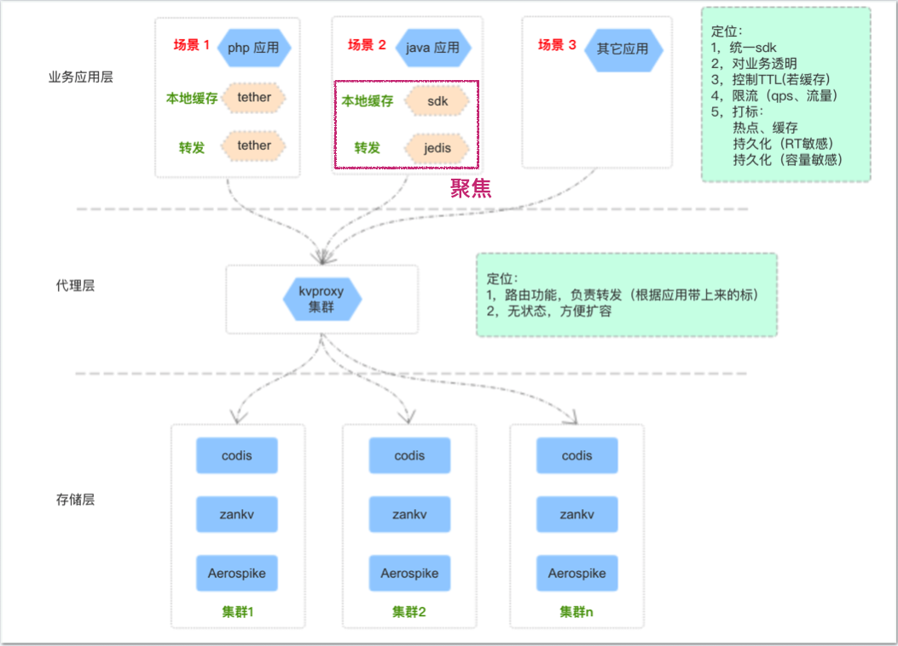
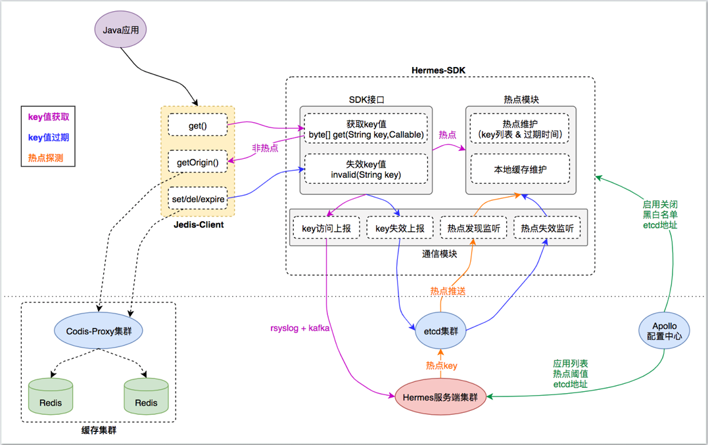
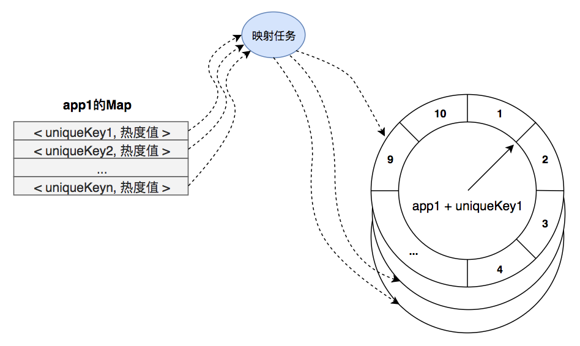
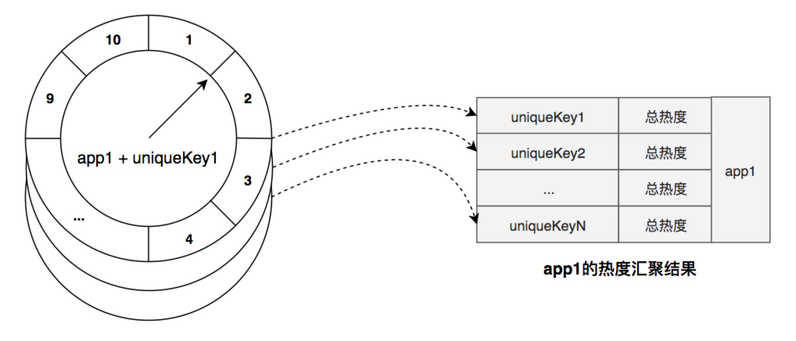
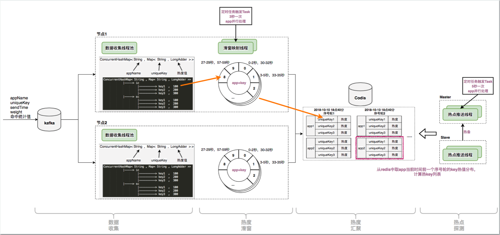
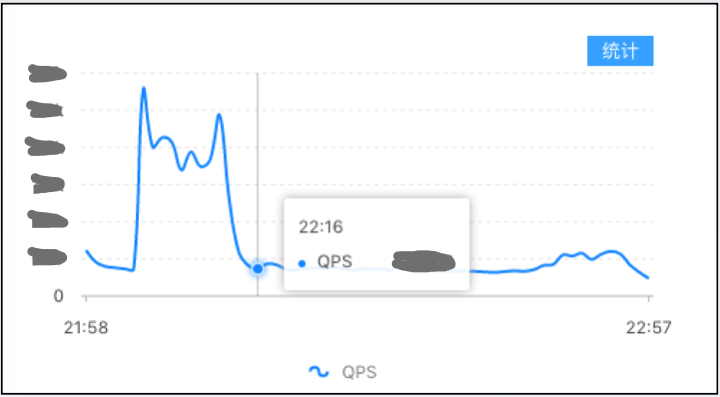
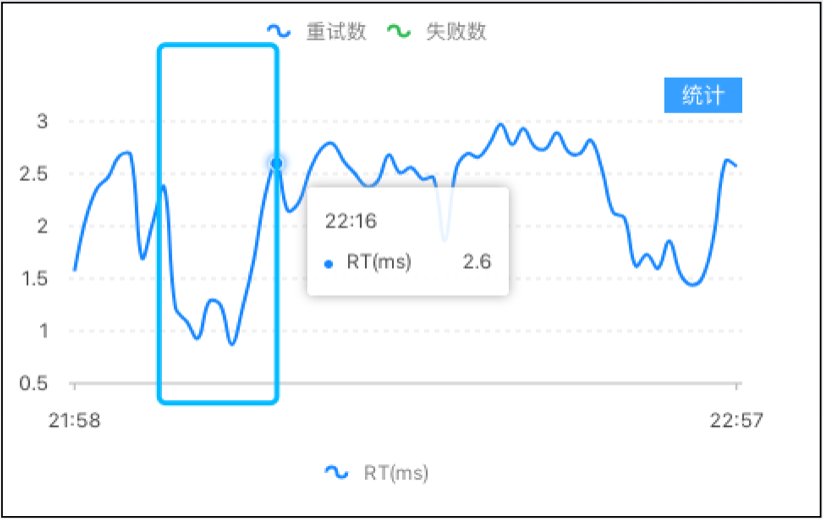

# 有赞透明多级缓存解决方案（TMC）

# 一、引子

## 1-1. TMC 是什么

TMC ，即“透明多级缓存（ Transparent Multilevel Cache ）”，是有赞 PaaS 团队给公司内应用提供的整体缓存解决方案。

TMC 在通用“分布式缓存解决方案（如 CodisProxy + Redis ，如有赞自研分布式缓存系统 zanKV ）”基础上，增加了以下功能：

- 应用层热点探测
- 应用层本地缓存
- 应用层缓存命中统计

以帮助应用层解决缓存使用过程中出现的热点访问问题。

## 1-2. 为什么要做 TMC

使用有赞服务的电商商家数量和类型很多，商家会不定期做一些“商品秒杀”、“商品推广”活动，导致“营销活动”、“商品详情”、“交易下单”等链路应用出现 **缓存热点访问** 的情况：

- 活动时间、活动类型、活动商品之类的信息不可预期，导致 *缓存热点访问* 情况不可提前预知；
- *缓存热点访问* 出现期间，应用层少数 **热点访问 key ** 产生大量缓存访问请求：冲击分布式缓存系统，大量占据内网带宽，最终影响应用层系统稳定性；

为了应对以上问题，需要一个能够 *自动发现热点* 并 *将热点缓存访问请求前置在应用层本地缓存* 的解决方案，这就是 TMC 产生的原因。

## 1-3. 多级缓存解决方案的痛点

基于上述描述，我们总结了下列 **多级缓存解决方案** 需要解决的需求痛点：

- 热点探测：如何快速且准确的发现 **热点访问 key ** ？
- 数据一致性：前置在应用层的本地缓存，如何保障与分布式缓存系统的数据一致性？
- 效果验证：如何让应用层查看本地缓存命中率、热点 key 等数据，验证多级缓存效果？
- 透明接入：整体解决方案如何减少对应用系统的入侵，做到快速平滑接入？

TMC 聚焦上述痛点，设计并实现了整体解决方案。以支持“热点探测”和“本地缓存”，减少热点访问时对下游分布式缓存服务的冲击，避免影响应用服务的性能及稳定性。

# 二、 TMC 整体架构

TMC 整体架构如上图，共分为三层：

- 存储层：提供基础的kv数据存储能力，针对不同的业务场景选用不同的存储服务（ codis / zankv / aerospike ）；
- 代理层：为应用层提供统一的缓存使用入口及通信协议，承担分布式数据水平切分后的路由功能转发工作；
- 应用层：提供统一客户端给应用服务使用，内置“热点探测”、“本地缓存”等功能，对业务透明；

本篇聚焦在应用层客户端的“热点探测”、“本地缓存”功能。

# 三、 TMC 本地缓存

## 3-1. 如何透明

TMC 是如何减少对业务应用系统的入侵，做到透明接入的？

对于公司 Java 应用服务，在缓存客户端使用方式上分为两类：

- 基于`spring.data.redis`包，使用`RedisTemplate`编写业务代码；
- 基于`youzan.framework.redis`包，使用`RedisClient`编写业务代码；

不论使用以上那种方式，最终通过`JedisPool`创建的`Jedis`对象与缓存服务端代理层做请求交互。

TMC 对原生jedis包的`JedisPool`和`Jedis`类做了改造，在JedisPool初始化过程中集成TMC“热点发现”+“本地缓存”功能`Hermes-SDK`包的初始化逻辑，使`Jedis`客户端与缓存服务端代理层交互时先与`Hermes-SDK`交互，从而完成 “热点探测”+“本地缓存”功能的透明接入。

对于 Java 应用服务，只需使用特定版本的 jedis-jar 包，无需修改代码，即可接入 TMC 使用“热点发现”+“本地缓存”功能，做到了对应用系统的最小入侵。

## 3-2. 整体结构

### 3-2-1. 模块划分

TMC 本地缓存整体结构分为如下模块：

- **Jedis-Client**： Java 应用与缓存服务端交互的直接入口，接口定义与原生 Jedis-Client 无异；
- **Hermes-SDK**：自研“热点发现+本地缓存”功能的SDK封装， Jedis-Client 通过与它交互来集成相应能力；
- **Hermes服务端集群**：接收 Hermes-SDK 上报的缓存访问数据，进行热点探测，将热点 key 推送给 Hermes-SDK 做本地缓存；
- **缓存集群**：由代理层和存储层组成，为应用客户端提供统一的分布式缓存服务入口；
- **基础组件**： etcd 集群、 Apollo 配置中心，为 TMC 提供“集群推送”和“统一配置”能力；

### 3-2-2. 基本流程

1） key 值获取

- Java 应用调用 **Jedis-Client** 接口获取key的缓存值时，**Jedis-Client** 会询问 **Hermes-SDK** 该 key 当前是否是 **热点key**；
- 对于 **热点key** ，直接从 **Hermes-SDK** 的 *热点模块* 获取热点 key 在本地缓存的 value 值，不去访问 **缓存集群** ，从而将访问请求前置在应用层；
- 对于非 **热点key** ，**Hermes-SDK** 会通过`Callable`回调 **Jedis-Client** 的原生接口，从 **缓存集群** 拿到 value 值；
- 对于 **Jedis-Client** 的每次 key 值访问请求，**Hermes-SDK** 都会通过其 *通信模块* 将 ***key访问事件\*** 异步上报给 **Hermes服务端集群** ，以便其根据上报数据进行“热点探测”；

2）key值过期

- Java 应用调用 **Jedis-Client** 的`set()` `del()` `expire()`接口时会导致对应 key 值失效，**Jedis-Client** 会同步调用 **Hermes-SDK** 的`invalid()`方法告知其“ key 值失效”事件；
- 对于 **热点key** ，**Hermes-SDK** 的 *热点模块* 会先将 key 在本地缓存的 value 值失效，以达到本地数据**强一致**。同时 *通信模块* 会异步将“ key 值失效”事件通过 **etcd集群** 推送给 Java 应用集群中其他 **Hermes-SDK** 节点；
- 其他**Hermes-SDK**节点的 *通信模块* 收到 “ key 值失效”事件后，会调用 *热点模块* 将 key 在本地缓存的 value 值失效，以达到集群数据**最终一致**；

3）热点发现

- **Hermes服务端集群** 不断收集 **Hermes-SDK**上报的 ***key访问事件***，对不同业务应用集群的缓存访问数据进行周期性（3s一次）分析计算，以探测业务应用集群中的**热点key**列表；
- 对于探测到的**热点key**列表，**Hermes服务端集群** 将其通过 **etcd集群** 推送给不同业务应用集群的 **Hermes-SDK** *通信模块*，通知其对**热点key**列表进行本地缓存；

4）配置读取

- **Hermes-SDK** 在启动及运行过程中，会从 **Apollo配置中心** 读取其关心的配置信息（如：启动关闭配置、黑白名单配置、etcd地址...）；
- **Hermes服务端集群** 在启动及运行过程中，会从 **Apollo配置中心** 读取其关心的配置信息（如：业务应用列表、热点阈值配置、 etcd 地址...）；

### 3-2-3. 稳定性

TMC本地缓存稳定性表现在以下方面：

- 数据上报异步化：**Hermes-SDK** 使用`rsyslog技术`对“ key 访问事件”进行异步化上报，不会阻塞业务；
- 通信模块线程隔离：**Hermes-SDK** 的 *通信模块* 使用独立线程池+有界队列，保证事件上报&监听的I/O操作与业务执行线程隔离，即使出现非预期性异常也不会影响基本业务功能；
- 缓存管控：**Hermes-SDK** 的 *热点模块* 对本地缓存大小上限进行了管控，使其占用内存不超过 64MB（LRU），杜绝 JVM 堆内存溢出的可能；

### 3-2-4. 一致性

TMC 本地缓存一致性表现在以下方面：

- **Hermes-SDK** 的 *热点模块* 仅缓存 **热点key** 数据，绝大多数非热点 key 数据由 **缓存集群** 存储；
- **热点key** 变更导致 value 失效时，**Hermes-SDK** 同步失效本地缓存，保证 **本地强一致**；
- **热点key** 变更导致 value 失效时，**Hermes-SDK** 通过 **etcd集群** 广播事件，异步失效业务应用集群中其他节点的本地缓存，保证 **集群最终一致**；

# 四、TMC热点发现

## 4-1. 整体流程

TMC 热点发现流程分为四步：

- **数据收集**：收集 **Hermes-SDK** 上报的 *key访问事件*；
- **热度滑窗**：对 App 的每个 Key ，维护一个时间轮，记录基于当前时刻滑窗的访问热度；
- **热度汇聚**：对 App 的所有 Key ，以`<key,热度>`的形式进行 *热度排序汇总*；
- **热点探测**：对 App ，从 *热Key排序汇总* 结果中选出 *TopN的热点Key* ，推送给 **Hermes-SDK**；

## 4-2. 数据收集

**Hermes-SDK** 通过本地`rsyslog`将 ***key访问事件*** 以协议格式放入 **kafka** ，**Hermes服务端集群** 的每个节点消费 kafka 消息，实时获取 ***key访问事件\***。

访问事件协议格式如下：

- appName：集群节点所属业务应用
- uniqueKey：业务应用 *key访问事件* 的 key
- sendTime：业务应用 *key访问事件* 的发生时间
- weight：业务应用 *key访问事件* 的访问权值

**Hermes服务端集群** 节点将收集到的 ***key访问事件*** 存储在本地内存中，内存数据结构为`Map<String, Map<String, LongAdder>>`，对应业务含义映射为`Map< appName , Map< uniqueKey , 热度 >>`。

## 4-3. 热度滑窗

### 4-3-1. 时间滑窗

**Hermes服务端集群** 节点，对每个App的每个 key ，维护了一个 ***时间轮\***：

- 时间轮中共10个 ***时间片\***，每个时间片记录当前 key 对应 3 秒时间周期的总访问次数；
- 时间轮10个时间片的记录累加即表示当前 key 从当前时间向前 30 秒时间窗口内的总访问次数；

### 4-3-2. 映射任务

**Hermes服务端集群** 节点，对每个 App *每3秒* 生成一个 **映射任务** ，交由节点内 *“缓存映射线程池”* 执行。**映射任务** 内容如下：

- 对当前 App ，从`Map< appName , Map< uniqueKey , 热度 >>`中取出 *appName* 对应的Map `Map< uniqueKey , 热度 >>`；
- 遍历`Map< uniqueKey , 热度 >>`中的 key ，对每个 key 取出其热度存入其 ***时间轮\*** 对应的时间片中；

## 4-4. 热度汇聚

完成第二步“热度滑窗”后，**映射任务** 继续对当前 App 进行“热度汇聚”工作：

- 遍历 App 的 key ，将每个 key 的 **时间轮** 热度进行汇总（即30秒时间窗口内总热度）得到探测时刻 **滑窗总热度**；
- 将 `< key , 滑窗总热度 >` 以排序集合的方式存入 *Redis存储服务* 中，即 **热度汇聚结果**；

## 4-5. 热点探测

- 在前几步，***每3秒*** 一次的 **映射任务** 执行，对每个 App 都会产生一份当前时刻的 **热度汇聚结果** ；
- **Hermes服务端集群** 中的“热点探测”节点，对每个 App ，只需周期性从其最近一份 **热度汇聚结果** 中取出达到热度阈值的 TopN 的 key 列表，即可得到本次探测的 **热点key列表**；

TMC 热点发现整体流程如下图：

## 4-6. 特性总结

### 4-6-1. 实时性

**Hermes-SDK**基于rsyslog + kafka 实时上报 ***key访问事件***。 **映射任务** 3秒一个周期完成“热度滑窗” + “热度汇聚”工作，当有 ***热点访问场景\*** 出现时最长3秒即可探测出对应 **热点key**。

### 4-6-2. 准确性

key 的**热度汇聚结果**由“基于时间轮实现的滑动窗口”汇聚得到，相对准确地反应当前及最近正在发生访问分布。

### 4-6-3.扩展性

**Hermes服务端集群** 节点无状态，节点数可基于 kafka 的 partition 数量横向扩展。

“热度滑窗” + “热度汇聚” 过程基于 App 数量，在单节点内多线程扩展。

# 五、TMC实战效果

## 5-1. 快手商家某次商品营销活动

有赞商家通过快手直播平台为某商品搞活动，造成该商品短时间内被集中访问产生访问热点，活动期间 TMC 记录的实际热点访问效果数据如下：

### 5-1-1. 某核心应用的缓存请求&命中率曲线图

*上图蓝线为应用集群调用`get()`方法访问缓存次数 * 上图绿线为获取缓存操作命中 TMC 本地缓存的次数

 上图为本地缓存命中率曲线图

可以看出活动期间缓存请求量及本地缓存命中量均有明显增长，本地缓存命中率达到近 80% （即应用集群中 80% 的缓存查询请求被 TMC 本地缓存拦截）。

### 5-1-2. 热点缓存对应用访问的加速效果

上图为应用接口QPS曲线

上图为应用接口RT曲线

可以看出活动期间应用接口的请求量有明显增长，由于 TMC 本地缓存的效果应用接口的 RT 反而出现下降。

## 5-2. 双十一期间部分应用 TMC 效果展示

### 5-2-1. 商品域核心应用效果

### 5-2-2. 活动域核心应用效果

# 六、TMC功能展望

在有赞， TMC 目前已为商品中心、物流中心、库存中心、营销活动、用户中心、网关&消息等多个核心应用模块提供服务，后续应用也在陆续接入中。

TMC 在提供“热点探测” + “本地缓存”的核心能力同时，也为应用服务提供了灵活的配置选择，应用服务可以结合实际业务情况在“热点阈值”、“热点key探测数量”、“热点黑白名单”维度进行自由配置以达到更好的使用效果。

最后， TMC 的迭代还在持续进行中...